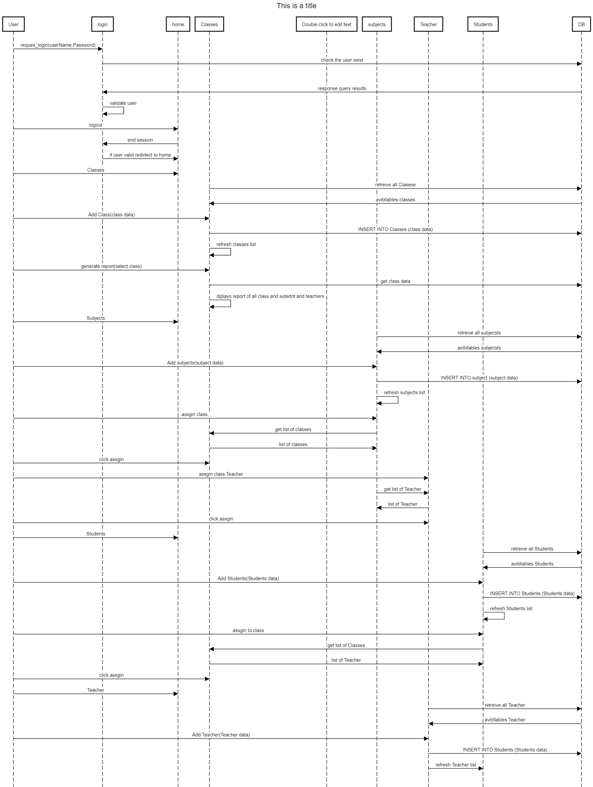
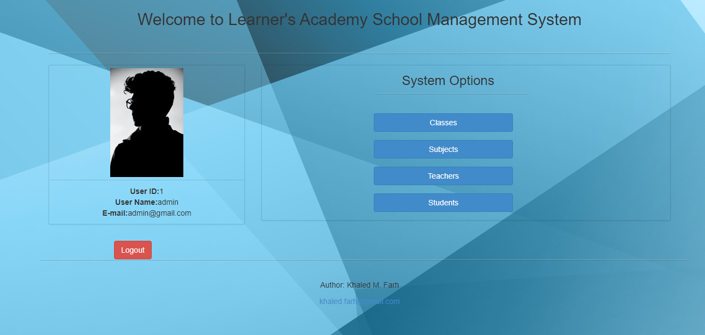

#  Leraner Academy web app

## Project component 

### Web App for managing school
## The pogramming lang used in this framework is JAVA
## Databse MySQL the script is added to the resouces [DataBaseinit.sql]
## Frameworks[Servlets, JSP , Hibernate]

## Sequnce Digram

## Output Screenshoot 

